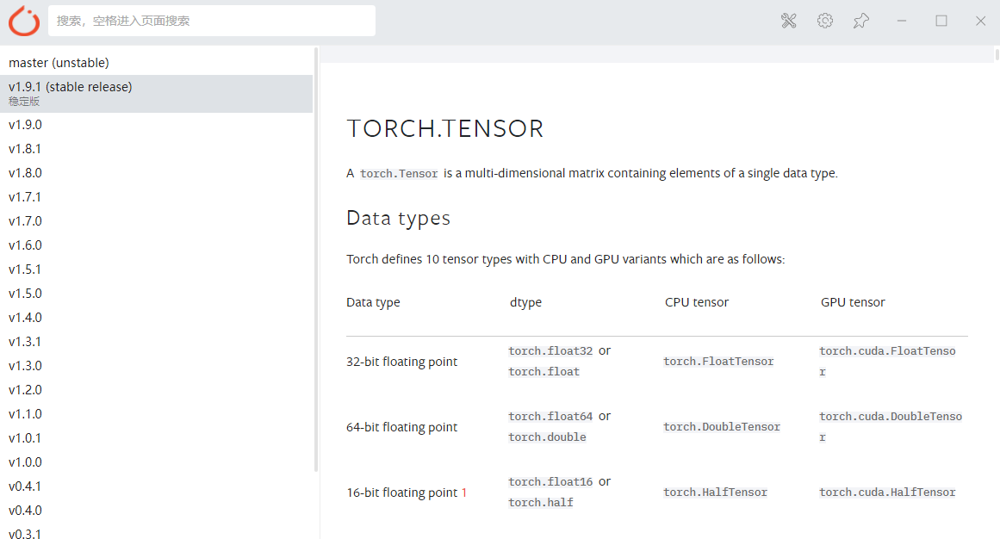
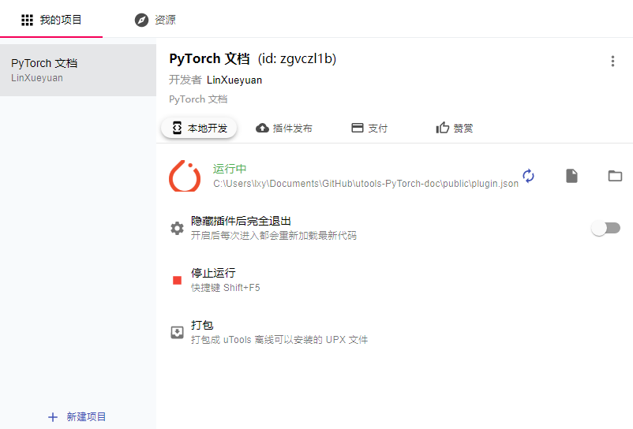

# utools-PyTorch-doc
uTools 插件 - PyTorch 文档（最新）

由于包含了所有文档（0.1.x到最新的1.9.1），导致插件太大，无法完成打包发布，想用就请自行从本地安装。

效果图：

## 从本地安装

1. 先用 uTools 安装 「uTools 开发者工具」，新建一个项目，并选择 `public/plugin.json` 文件。
2. 点击 「开启运行」。
3. 退出开发者工具，在 uTools 中输入 `torch` 即可打开文档。

## 参考

官方插件教程 https://u.tools/docs/developer/welcome.html#plugin-json